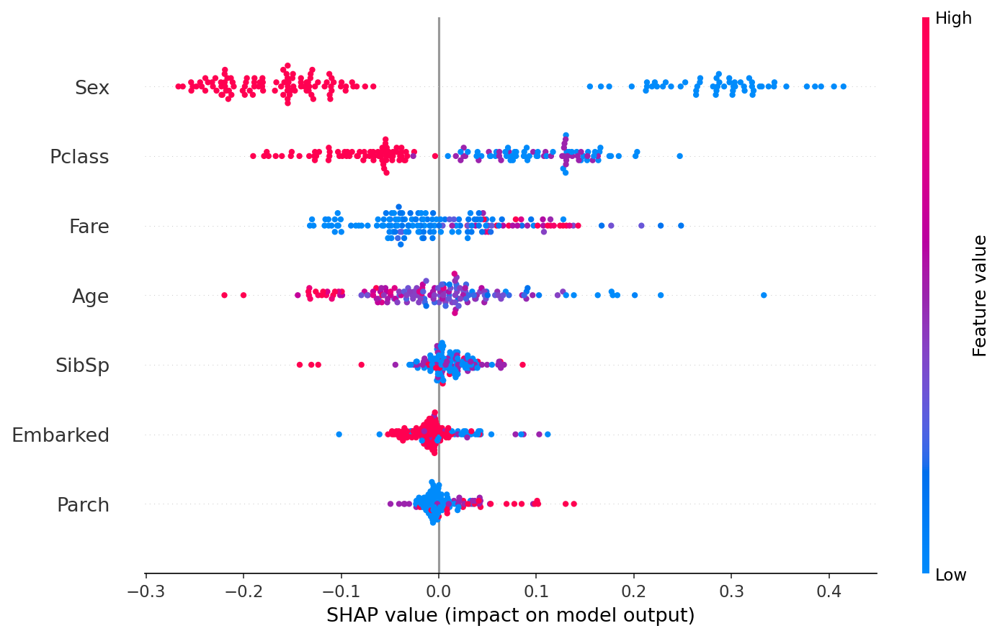
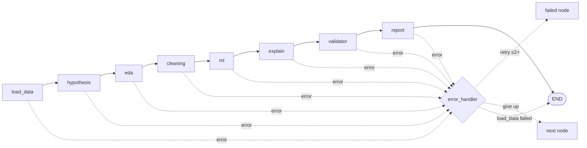

# ADA — Autonomous Data Analysis Agent

[](https://github.com/sid23git/-ADA-project/actions/workflows/ci.yml)


Upload a CSV and ADA works through it the way a data scientist would. It forms hypotheses
*before* looking at the data, explores, cleans, trains and compares models, explains them with
SHAP, and then **tests every hypothesis with a real statistical test** before writing the report.

It's a multi-agent pipeline built on **LangGraph**, with **Claude** as the reasoning layer, a
**Streamlit** front end, and a 51-test suite that runs the whole pipeline offline in CI.

---

## The core idea: the LLM proposes, code decides

Most "AI data analyst" demos ask an LLM whether a hypothesis is true. LLMs are fluent but not
calibrated: they will happily call `p = 0.04` on 50,000 rows a "strong finding". ADA divides the
work so that **anything with a correct answer is computed, and the model only does what models are
good at**:

| Decision | Who makes it | How |
|---|---|---|
| Which hypotheses are worth testing | **Claude** | Emits a typed `TestSpec` (claim type, columns, direction), validated by pydantic |
| Whether a hypothesis is true | **Code** | Welch t / Mann-Whitney / χ² / Fisher / Pearson / Spearman, selected by assumption checks |
| Correcting for 5 tests at once | **Code** | Benjamini-Hochberg (FDR) or Holm adjustment across the family |
| Whether an effect *matters* | **Code** | Effect size + 95% CI against conventional thresholds |
| Classification vs regression | **Code** | Target dtype and cardinality |
| Which model is best | **Code** | Highest cross-validated F1 / R² |
| How to clean the data | **Claude** proposes, **code** guards | Schema-validated plan; code refuses unsafe steps (e.g. dropping the target) |
| Explaining results in plain English | **Claude** | Gets the computed numbers and is told the verdict is final |

This boundary is enforced, not just a convention. `utils/stat_tests.py` must never import the
LLM layer, and a test parses its AST and fails the build if it does. The response schema for
interpretations has no verdict field and uses `extra="forbid"`, so a model that tries to add its
own verdict fails validation and is retried.

## Example: Titanic (`data/sample.csv`)

These numbers are from an actual run (`python main.py`). Four of the five hypotheses are shown:

| Hypothesis (generated by Claude before any analysis) | Test chosen | Effect (95% CI) | Verdict |
|---|---|---|---|
| H1: Female passengers survived at a higher rate | χ² (Yates) | OR = 12.35 [8.90, 17.14] | ✅ CONFIRMED |
| H2: First-class passengers survived at a higher rate | χ² (Yates) | OR = 3.87 [2.81, 5.34] | ✅ CONFIRMED |
| H3: Younger passengers survived more | Pearson | r = −0.077 [−0.150, −0.004], q = 0.039 | 🔍 **SIGNIFICANT_BUT_TRIVIAL** |
| H5: Fare is positively correlated with survival | Pearson | r = 0.257 [0.195, 0.318] | ✅ CONFIRMED |

H3 is the interesting one. It passes `p < 0.05`, so a naive pipeline would report it as
confirmed. But age explains about 0.6% of the variance in survival, so ADA flags it as
statistically significant but practically meaningless.

**Models** (5-fold stratified CV, weighted F1; best is picked in code):

| Model | Hold-out F1 | CV F1 |
|---|---|---|
| Logistic Regression | 0.768 | 0.768 |
| **Random Forest** | **0.824** | **0.777** |
| XGBoost | 0.804 | 0.775 |

**SHAP explanation of the selected model:**



## Architecture



- **Shared typed state.** One `ADAState` `TypedDict` flows through every node. Nodes never mutate
  it; each one returns `{**state, ...updates}`.
- **Self-healing graph.** A failing node sets `state["error"]`. A conditional edge routes to
  `error_handler`, which retries that node up to twice, then skips it. If `load_data` fails,
  the run stops cleanly.
- **Graceful degradation.** Hypothesis, explanation and validation are optional, so their failure
  never blocks the report. If cleaning gives up, ML trains on the raw frame instead.
- **Validated structured output.** Every JSON response from Claude goes through `call_llm_json`.
  It parses the response against a pydantic model and, on failure, re-prompts with the
  validation error included.
- **Single LLM choke point.** All calls go through `utils/llm.py`. Swapping the model is one env
  var (`ADA_MODEL`), and the test suite swaps in a fake client at the same point.
- **Full audit trail.** Every agent action is timestamped, shown in the UI and saved as JSON.
- **Real progress.** The UI subscribes to the LangGraph stream, so the progress bar moves when
  each node actually finishes.

### Agents

| Agent | Does |
|---|---|
| `hypothesis_agent` | Profiles columns (dtype, cardinality, usable roles, levels) and asks Claude for 5 typed, testable hypotheses. Flags any that reference columns that don't exist. |
| `eda_agent` | Computes summary stats with pandas; Claude narrates them. |
| `cleaning_agent` | Claude proposes a per-column plan; code applies it deterministically, protects the target, and falls back safely (e.g. `mean` on a text column → `mode`). |
| `ml_agent` | Trains LogReg/Linear, Random Forest and XGBoost. Linear models use a scaling `Pipeline`, so CV doesn't leak. Reports accuracy, F1, ROC-AUC (or R², RMSE, MAE) and selects by CV score. |
| `explain_agent` | Retrains the selected model with the *same* feature prep and split, computes SHAP values, and saves the beeswarm plot. |
| `validator_agent` | Runs the statistical tests on the raw (un-imputed) data, corrects for multiple comparisons, then has Claude interpret the numbers. |

## Statistical rigour

The details that keep the verdicts honest live in `utils/stat_tests.py` and `utils/effect_sizes.py`:

- **Test selection by assumptions.** Uses Shapiro-Wilk below n = 30, the CLT above it, and Levene
  for equal variances. Welch's t is always used instead of Student's t. Fisher's exact test
  replaces χ² when expected cell counts fall below 5.
- **Directional claims are checked for direction.** A significant effect in the *opposite*
  direction is `REJECTED`, not confirmed.
- **Bias-corrected effect sizes with CIs:**
  - Hedges' g instead of Cohen's d
  - Bias-corrected Cramér's V
  - Odds ratio with Woolf CI and Haldane correction
  - Agresti-Caffo CI for risk difference
  - Fisher-z CI for Spearman
  - Seeded bootstrap otherwise
- **Tests run on the raw data, not the imputed frame.** Imputed values add rows that were never
  observed and bias p-values downward.
- **Honest failure modes.** `NOT_TESTABLE` is used for a hallucinated column or wrong dtype, and
  `INSUFFICIENT_DATA` for groups that are too small or sparse contingency tables. A
  `NOT_SUPPORTED` verdict never claims the null is true.

## Testing

```bash
pip install -r requirements-dev.txt
pytest          # 51 tests, ~15s, no API key needed
ruff check .
```

`tests/fakes.py` provides `FakeAnthropic`, an offline stand-in for the Claude client. It lets the
suite run the **entire pipeline end to end** with real pandas, scikit-learn, XGBoost, SHAP and
SciPy, and only the language model simulated. The canned responses are adversarial on purpose:
the cleaning plan tries to drop the target column, the ML interpretation names the wrong best
model, and one hypothesis references a column that doesn't exist. The tests assert that code
overrules all three.

| Suite | Covers |
|---|---|
| `test_stat_tests.py` | Effect sizes against hand-computed values, BH/Holm correction, column resolution, verdict logic, planted-effect recovery, the no-LLM-import invariant |
| `test_pipeline.py` | Full offline run, retry-then-succeed, retry-exhaustion-then-skip, critical-failure stop, routing functions |
| `test_agents.py` | Target protection, dtype-safe imputation, schema rejection, problem-type detection, model selection, XGBoost label encoding, regression CV |
| `test_app.py` | Streamlit landing page renders (via `streamlit.testing`) |

CI (GitHub Actions) runs lint and the full suite on every push and PR.

## Quickstart

```bash
git clone https://github.com/sid23git/-ADA-project.git
cd ./-ADA-project          # the ./ stops cd reading the leading "-" as a flag
python -m venv venv && source venv/bin/activate      # Windows: venv\Scripts\activate
pip install -r requirements.txt
cp .env.example .env                                 # then add your ANTHROPIC_API_KEY
```

**Web UI**

```bash
streamlit run app.py
```

**Command line**

```bash
python main.py                                  # Titanic sample, target = Survived
python main.py path/to/data.csv --target Price
```

**Docker**

```bash
docker build -t ada .
docker run -p 8501:8501 --env-file .env ada     # open http://localhost:8501
```

Each run writes a report and an audit-trail JSON to `outputs/`.

## Project structure

```
ada_graph.py           LangGraph state machine: nodes, error routing, streaming runner
app.py                 Streamlit UI (8 result tabs)
main.py                CLI entry point
agents/                One module per agent, each with a run_*_agent() entry point
utils/
  llm.py               Single Claude choke point + validated JSON output with retry
  ada_state.py         Shared pipeline state (TypedDict)
  hypothesis_schema.py Typed hypothesis / TestSpec / Verdict vocabulary (pydantic)
  stat_tests.py        Test selection, execution, multiple-comparison correction, verdicts
  effect_sizes.py      Effect sizes and confidence intervals
tests/                 51 tests, including an offline fake Claude client
```

## Design trade-offs and limitations

- **Haiku by default.** The pipeline makes 7 LLM calls per run, and every high-stakes
  decision is made in code, so a fast, cheap model is enough. Set `ADA_MODEL` to change it.
- **Benjamini-Hochberg by default.** BH controls the false discovery rate, which suits an
  exploratory tool. Holm is implemented and arguably the better choice when every confirmed
  claim will be shown to a human.
- **Feature encoding is basic.** Categoricals are label-encoded, which tree models handle well
  but linear models don't. One-hot encoding for linear models is the obvious next step.
- **The ML stage needs a target column.** Unsupervised analysis (clustering, anomaly detection)
  is out of scope for now.
- **Single-process and synchronous.** A long run blocks the Streamlit session. A job queue would
  be needed for multi-user deployment.

## Tech stack

Python 3.12 · LangGraph · Anthropic Claude API · pydantic · pandas · SciPy · scikit-learn ·
XGBoost · SHAP · Streamlit · pytest · ruff · GitHub Actions · Docker
