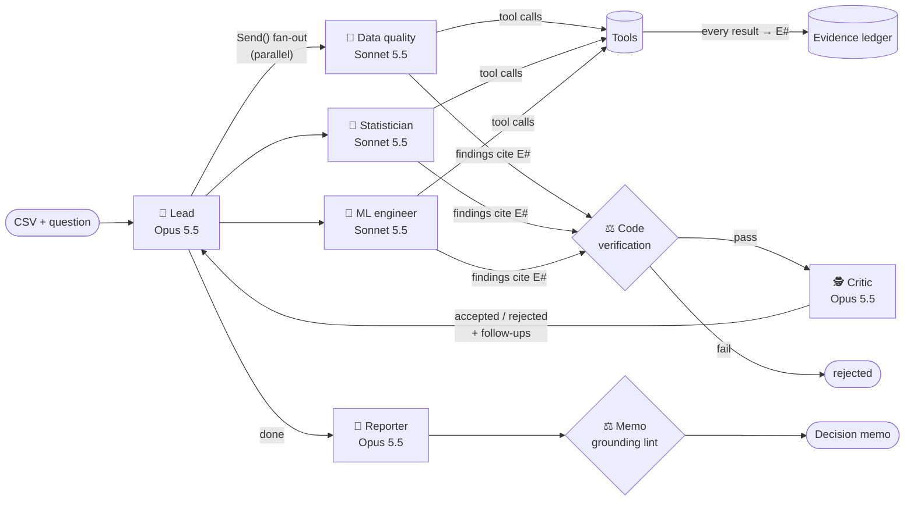

# ADA — an AI data-science team you can audit

[](https://github.com/sid23git/ada-agent-team/actions/workflows/ci.yml)


**🚀 [Try the live demo](https://lgla6kmbujefu7glenjaqt.streamlit.app/)** (free offline mode, or bring your own API key) · **📄 [Example memo the agents wrote](docs/example_run/churn_memo.md)** · **📦 `pip install git+https://github.com/sid23git/ada-agent-team.git`** · **📘 [Complete project guide (beginner to interview-ready)](docs/PROJECT_GUIDE.md)**

Give ADA a CSV and a business question ("What drives churn, and who should the retention team
call?"). A team of AI agents investigates it the way a good analytics team would:

- A **lead** plans the investigation.
- Three **specialists** work in parallel with real analysis tools.
- A **critic** challenges every claim.
- A **reporter** writes a decision memo.

**Every number in that memo traces back to a computed result, and code checks this. The model
isn't trusted to.**

> LLM analysts fail quietly: a plausible number that was never computed, a p-value that wouldn't
> survive the other twenty tests, a "driver" that is really a leaked column. ADA is built around
> catching those failures, and it has an evaluation suite that measures how often it does.

---

## How it works



1. **The lead plans; it doesn't analyse.** It reads the column profile and dispatches precise
   briefs to the specialists. Each round it reads the critic's verdicts and follow-up requests,
   then decides whether to dig further or stop. Routing is decided by the model at run time, not
   hard-coded.
2. **Specialists run in parallel** (LangGraph `Send` fan-out) as tool-using agents in a manual
   Claude tool-use loop. Each has its own toolset:

   | Specialist | Tools |
   |---|---|
   | 🧹 Data quality | `check_data_quality`, `describe_column`, `group_summary`, `run_python` |
   | 📐 Statistician | `run_hypothesis_test`, `correlations`, `group_summary`, `run_python` |
   | 🤖 ML engineer | `train_models` (CV, model selection, leakage detection), `explain_model` (SHAP) |

3. **Every tool result is written to the evidence ledger** with an ID (E1, E2, …) before the
   agent sees it. Agents finish by calling `submit_findings`, and every finding must cite
   evidence IDs.
4. **Code verifies each finding before the critic sees it:**
   - Do the citations exist?
   - Does every number in the claim appear in the cited evidence?
   - Is a statistical claim backed by a test that is CONFIRMED *after correction across every
     test the whole team has run*?

   Failures are rejected in code, and the critic can't overrule that.
5. **The critic (Opus) judges what code can't:**
   - overclaiming and causal language
   - misread evidence
   - confounders
   - findings undermined by a data-quality issue another agent found

   It can make a verdict stricter, never rescue a finding. Its follow-up requests go back to the
   lead.
6. **The reporter writes the memo from accepted findings only**, citing `[F#]`. A linter then
   checks every sentence that contains a number against the evidence behind its citations. If any
   fail, the reporter gets one revision pass with the linter's complaints.

## Engineering highlights

| | |
|---|---|
| **Hallucination-resistant by construction** | Numeric grounding is checked deterministically: rounding-aware, percentage-aware, and it ignores labels like `95% CI` or `13–36 months`. In live runs it caught agents doing arithmetic in their heads and quoting numbers they never cited. |
| **Team-wide multiple-comparison correction** | Parallel agents running many tests is p-hacking by default. The ledger re-applies Benjamini-Hochberg across *every* test any agent has run. A result that was significant in round 1 can lose that status in round 3, and the final re-verification demotes it. |
| **Real statistics, not vibes** | Tests are chosen by assumption checks: Welch / Mann-Whitney / χ² / Fisher / Pearson / Spearman / ANOVA / Kruskal-Wallis. Effect sizes come with 95% CIs, and `SIGNIFICANT_BUT_TRIVIAL` is a separate verdict. |
| **Leakage detection** | Any feature that predicts the target almost perfectly on its own is flagged as recorded-after-the-outcome. A model with F1 = 1.0 is treated as a warning, not a win. |
| **Sandboxed code execution** | `run_python` lets agents write ad-hoc pandas. It is guarded three ways: AST validation (no imports, I/O or dunder escapes), restricted builtins, and a subprocess with a timeout. |
| **Cost-aware model routing** | Opus 5.5 handles the judgement roles (lead, critic, reporter) and Sonnet 5.5 the high-volume tool loops. Prompt caching and a hard USD budget apply; when the budget runs out, the run ends gracefully with a memo. |
| **Observability** | Every LLM and tool call becomes a span with tokens, cost and latency. The UI shows a live agent feed, a per-agent cost table and a timeline where parallel specialists visibly overlap. |
| **Fault isolation** | A crashed specialist doesn't sink the round, and a failing UI callback can't kill an agent. Invalid tool arguments go back to the agent as readable errors so it can correct itself. |
| **Tested without an API key** | `ScriptedClaude` is a rule-based stand-in for the model. It runs the real tools, ledger, verifier and LangGraph orchestration, so the full multi-agent system is tested in CI for free. |

## Evaluation: does it actually find the truth?

`evals/` generates seeded synthetic datasets with **planted ground truth**: real drivers, pure
noise columns, and traps a careful analyst should catch. Grading uses the structured findings,
never memo wording.

| Scenario | What it tests |
|---|---|
| `churn` | Find the 4 real drivers among 3 noise columns |
| `leakage` | Spot a column recorded *after* cancellation that "predicts" churn at 97% |
| `dirty_readmission` | Catch `-999` placeholder ages and duplicated encounters, then find the drivers |
| `null_world` | Conversion is pure noise. The only correct answer is "nothing here predicts it" |

### Results: Claude agent team (live)

Lead, critic and reporter run on Opus 5.5; specialists on Sonnet 5.5.

| Scenario | Driver recall | False discoveries | Trap caught | Memo grounding | Rejected (verification / critic) | Cost | Pass |
|---|---|---|---|---|---|---|---|
| churn (run 1) | **100%** | none | — | **100%** | 6 / 4 | $1.00 | ✅ |
| churn (run 2) | **100%** | none | — | **100%** | 4 / 3 | $0.96 | ✅ |
| leakage | **100%** | none | ✅ flagged *and excluded* the leaked column | **100%** | 5 / 3 | $0.87 | ✅ |
| dirty_readmission | | | | | | | not yet run live |
| null_world | | | | | | | not yet run live |

### Baseline: naive rule-based agents (`--offline`)

| Scenario | Driver recall | False discoveries | Trap caught | Pass |
|---|---|---|---|---|
| churn | 75% | none | — | ✅ |
| leakage | 75% | **reported the leaked column as a driver** | ✅ | ❌ |
| dirty_readmission | 100% | none | ✅ sentinel, ✅ duplicates | ✅ |
| null_world | — | **reported a noise column as a driver** | — | ❌ |

The baseline falls into exactly the traps the suite was built around:

- In `leakage`, it tests the most-correlated column and reports it as a driver.
- In `null_world`, it reports the top SHAP feature of a model that is no better than guessing.

The Claude team instead recognised `exit_survey_completed` as data recorded after
cancellation, excluded it, and rebuilt the model without it.

What the live runs showed:

- **Code verification rejected 4 to 6 findings per run.** In most cases a specialist had done
  arithmetic in its head (e.g. a difference between two AUCs) or quoted a number from another
  finding without citing its evidence.
- **The critic rejected 3 to 4 more on judgement.** One example: *"Tenure under 24 months on a
  two-year contract is the normal state of any customer still in their first contract term, so
  flagging these 265 rows as potential errors misreads ordinary data."*
- **The lead tested for confounding unprompted.** Round 2 included "check that the contract
  effect survives controlling for tenure".

📄 **[Read the memo the agents wrote for the churn scenario →](docs/example_run/churn_memo.md)**

All 24 of its numeric sentences cite a finding and pass the grounding check. The full trace (33
findings, 27 evidence items, 3 rounds, every critic verdict) is in
[`churn_investigation.json`](docs/example_run/churn_investigation.json).

> The eval also improved the system. Live runs exposed a verifier that was too strict (it treated
> "95% CI" and the bin label "13–36 months" as claimed measurements), a grader that misread
> correct null findings, and a crash when the API ran out of credit. Each one is fixed and now
> has a regression test. Graders are deterministic and runs are saved, so `python -m
> evals.regrade runs/<dir>` re-scores past live runs for free.

## Use it

There are three ways in, depending on who you are.

### 1. Try it in your browser (no install)

Open the **[live demo](https://lgla6kmbujefu7glenjaqt.streamlit.app/)** and pick a dataset or upload your own CSV. The free **Offline**
mode runs the whole system with scripted agents. **Live** mode uses real Claude agents with
*your own* Anthropic API key, which is used only for your session and never stored. Runs are
capped at $2.

### 2. Install it as a tool

```bash
pip install "git+https://github.com/sid23git/ada-agent-team.git"
export ANTHROPIC_API_KEY=sk-ant-...                    # Windows: set ANTHROPIC_API_KEY=...

ada sales.csv "What drives repeat purchases?" --target repeat_buyer --max-cost 2
ada sales.csv "What drives repeat purchases?" --target repeat_buyer --offline   # free, no key
```

Or call it from Python, e.g. in a notebook or another service:

```python
from ada import investigate

result = investigate("sales.csv", "What drives repeat purchases?", target="repeat_buyer")
print(result.memo)                                      # the decision memo, every number cited
for f in result.ledger.findings("accepted"):            # structured findings with evidence IDs
    print(f.id, f.kind, f.claim, f.evidence_ids)
print(result.tracer.summary()["total_cost_usd"])
```

### 3. Develop on it

```bash
git clone https://github.com/sid23git/ada-agent-team.git && cd ada-agent-team
python -m venv venv && source venv/bin/activate        # Windows: venv\Scripts\activate
pip install -r requirements.txt
cp .env.example .env                                   # add ANTHROPIC_API_KEY for live agents
```

**Web UI.** Pick a demo dataset or upload a CSV:

```bash
streamlit run app.py
```

No API key? Choose **Offline — scripted**. It runs the full system with rule-based agents.

**CLI**

```bash
python -m ada data/sample.csv "What determined who survived?" --target Survived --max-cost 2
python -m ada data/sample.csv "What determined who survived?" --target Survived --offline
```

**Evals**

```bash
python -m evals.run --offline             # free: checks the harness with scripted agents
python -m evals.run churn null_world      # live: real agents, ~$1 per scenario
```

**Docker**

```bash
docker build -t ada . && docker run -p 8501:8501 --env-file .env ada
```

Each run saves `runs/<timestamp>/memo.md`, `investigation.json` (every finding, evidence item,
span and event) and the SHAP plot.

**Host your own public copy.** See [docs/DEPLOY.md](docs/DEPLOY.md). It takes about 5 minutes on
the free Streamlit Community Cloud. Public mode (`ADA_PUBLIC_DEMO=1`) is built for strangers'
data:

- Visitors bring their own key; the server's key is never used.
- Each run gets its own API client, so concurrent visitors can't share keys.
- Budgets and uploads are capped.
- Agent-written code execution is disabled, because uploaded data is untrusted input.

**Privacy.** In live mode, the dataset's column profile and the agents' tool results (summary
statistics, test results, small samples of values) are sent to Anthropic's API. Use offline mode,
or your own deployment, for data you can't share.

## Testing

```bash
pip install -r requirements-dev.txt
pytest        # 88 tests, no API key, ~1 minute
ruff check .
```

| Suite | Covers |
|---|---|
| `test_investigation.py` | Full multi-agent runs through LangGraph; adversarial agents (an invented number gets rejected before the critic sees it); a crashed specialist; budget exhaustion; lead-chosen target; eval grading |
| `test_verify.py` | Grounding (rounding, percentages, labels), citation and statistical-support checks, memo lint, plus regressions found in live runs |
| `test_tools.py` | Tool schemas, evidence recording, self-correcting errors, team-wide BH correction overturning an earlier verdict, leakage, sandbox escapes and timeouts |
| `test_stats.py` | Effect sizes against hand-computed values, BH/Holm, verdict logic, planted-effect recovery, and an AST check that the stats engine can't import the LLM layer |
| `test_ml.py` | Problem typing, model selection, label encoding, leakage flagging, SHAP direction |
| `test_app.py` | Streamlit landing page, and a full investigation driven through the UI |

## Project structure

```
ada/
  graph.py          LangGraph loop: lead -> parallel specialists (Send) -> critic -> ... -> report
  agents/           base.py (tool-use loop), team.py (lead/critic/reporter), prompts.py
  tools/            catalog.py (9 tools), registry.py (validation + evidence), sandbox.py
  ledger.py         evidence + findings, team-wide multiple-comparison correction
  verify.py         deterministic grounding / citation / support checks, memo lint
  stats/            statistical tests, effect sizes, typed hypothesis schema
  ml/               model training & selection, leakage detection, SHAP
  llm.py            the only module that calls Claude: budget, caching, fallbacks, retries
  tracing.py        spans, events, cost, budget guard
  offline.py        ScriptedClaude — offline stand-in for tests, CI and demos
evals/              scenarios with planted truth, graders, runner, results/
app.py              Streamlit UI
```

## Design decisions & trade-offs

- **A manual agent loop instead of a framework's agent abstraction.** The loop is where ADA's
  guarantees live: evidence recording, budget checks, step limits, tracing. Owning ~80 lines of
  loop is cheaper than fighting a framework for that control. LangGraph is still used for what
  it's good at, which is orchestration, parallel fan-out and state.
- **Deterministic checks before LLM judgement.** Anything with a checkable answer (does this
  number exist? did this test survive correction?) is decided by code, which is cheaper and
  can't be talked out of its answer. The critic model is spent only on judgement calls.
- **Raw data, flagged, not silently cleaned.** Earlier versions imputed data before testing,
  which manufactures certainty. Now the data-quality agent reports issues and the other agents
  account for them, which keeps the evidence honest.
- **Known limitations:**
  - Observational data only; ADA reports associations, not causes.
  - The sandbox is defense in depth, not a multi-tenant security boundary. Production should use
    a container sandbox or server-side code execution.
  - Synthetic evals measure the failure modes they were designed for, not everything.
  - Runs are synchronous; a production service would put investigations on a job queue.

## Version history

- **v4 (current):** multi-agent team with evidence ledger, verification, critic, evals and
  observability.
- **v3.1** (`git checkout v3.1`): linear 8-step LangGraph pipeline with statistically validated
  hypotheses.
